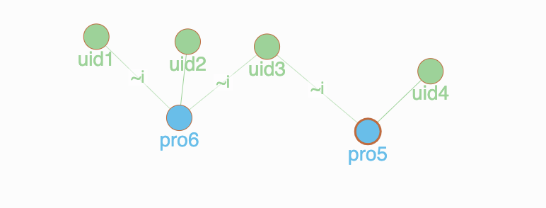
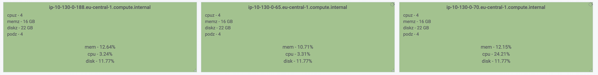
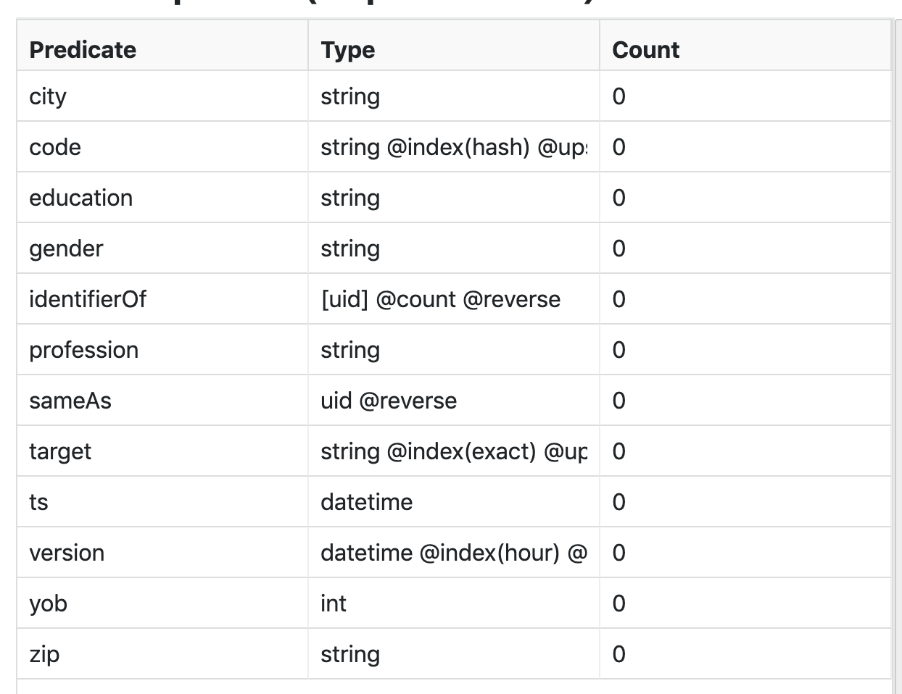
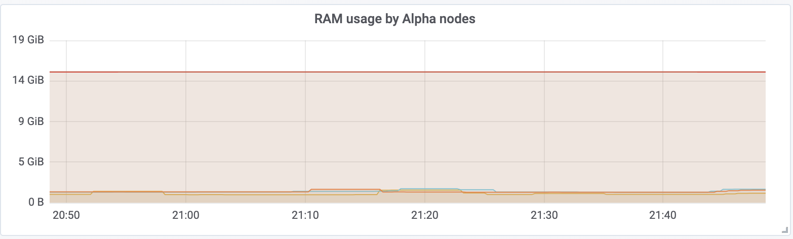
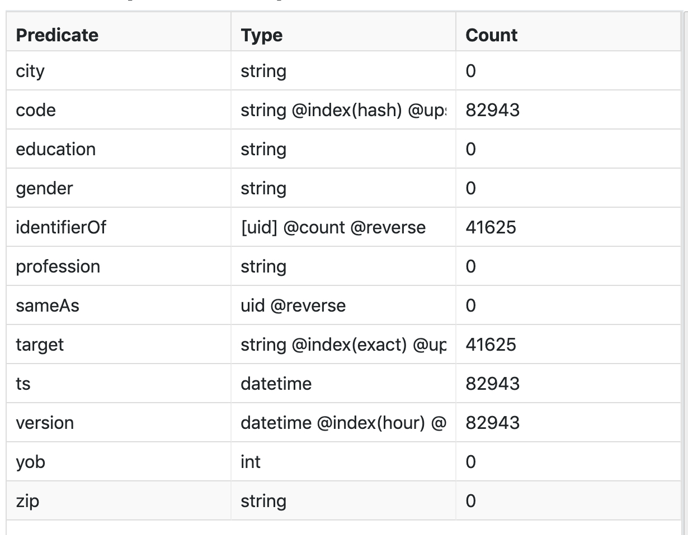
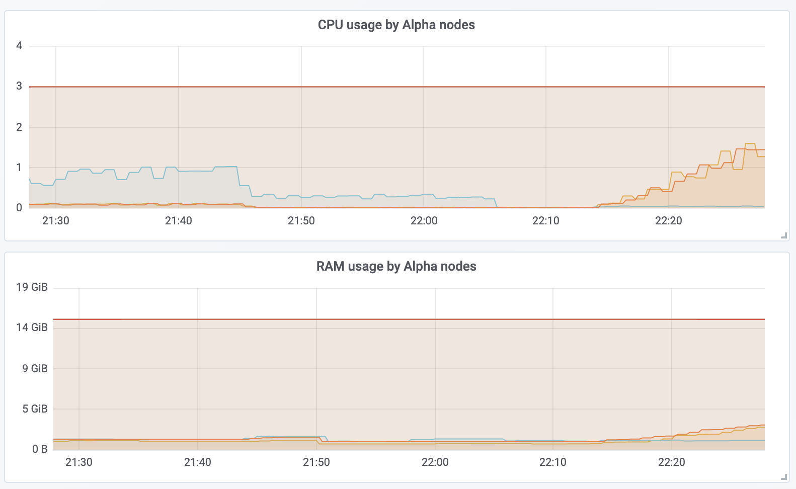
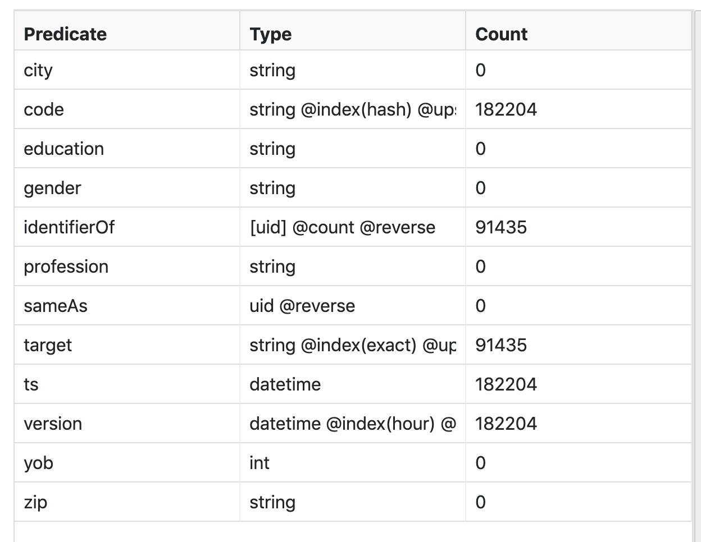
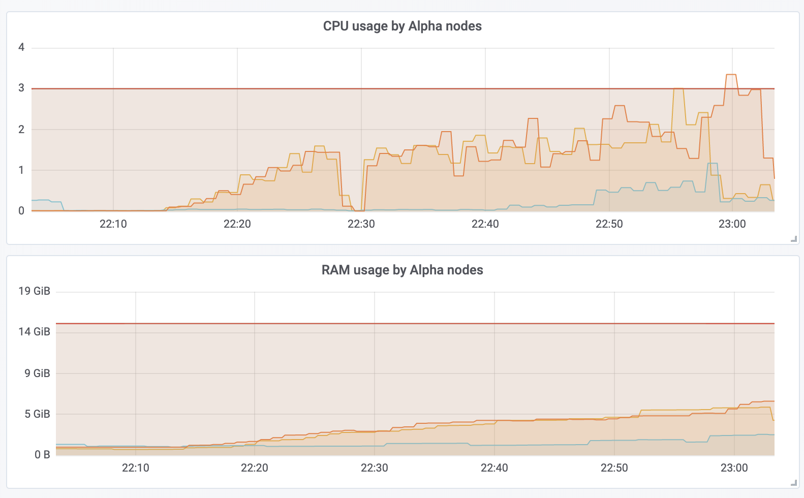
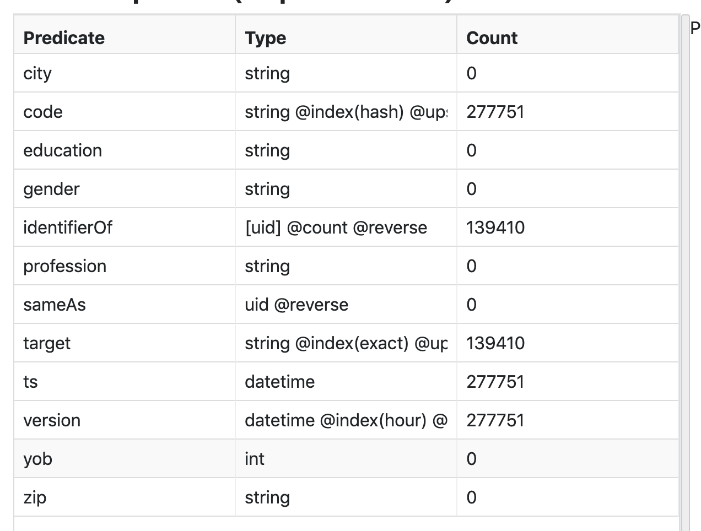
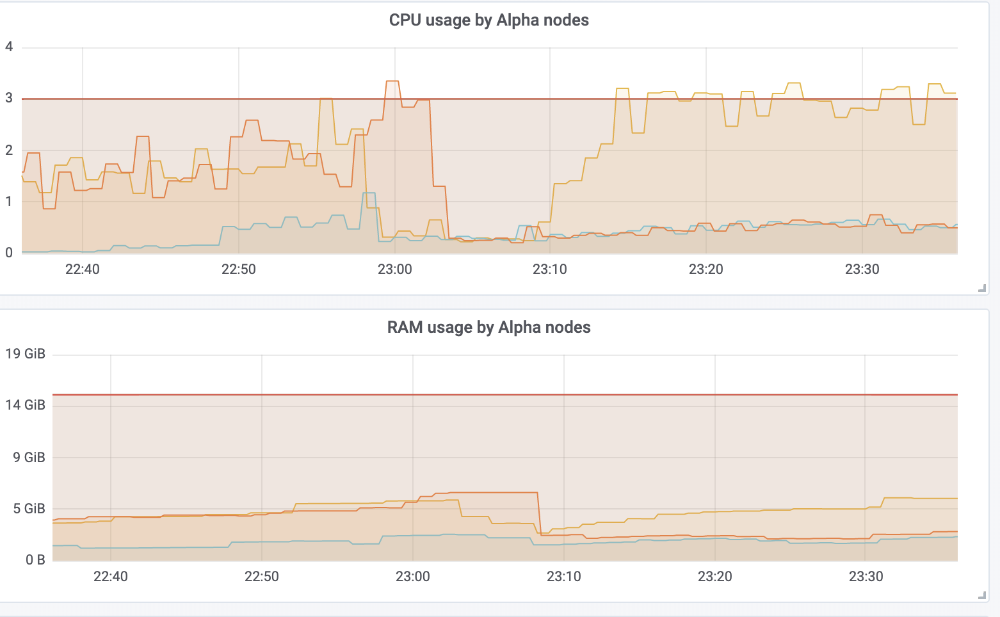

## Dgraph test

The repository contains application and data sets that can be used for performance and load testing of 
[DGraph](https://dgraph.io/).

`NOTE: This is quick written app with intention to demonstrate memory usage by DGraph when serving applications with constant read and write. It has simply used println instead of logger, feel free to comment prints or add more if you need to debug.`

To run application you need to have installed [SBT](https://www.scala-sbt.org/1.0/docs/Setup.html)

## Use case

Requirement is to create uniform user profiles database based on number of different id's that user
can have. Id can be anything that belongs to the user like cookie value, logged user id, device id,...

Data are streaming constantly to the system and building user profiles must be in real time with minimal delay.

To simplify test we will use two types of identifiers, one named `UidIdentifier` and another named `BidIdentifier`.
Details of profile will be ignored, so minimal schema for use case is as below. Note that `Identifier`
is type that represents both `UidIdentifier` and `BidIdentifier`.

```go
type Identifier {
    target: string
    identifierOf: [Profile]
    code: string
    version: datetime
    ts: datatime
}

type BidIdentifier {
    target: string
    identifierOf: [Profile]
    code: string
    version: datetime
    ts: datatime
}

type UidIdentifier {
    target: string
    identifierOf: [Profile]
    code: string
    version: datetime
    ts: datatime
}

type Profile {
    code: string
    version: datetime
    ts: datatime
}

<code>: string @upsert @index(hash) @count .
<identifierOf>: [uid] @reverse @count .
<target>: string @index(exact) @upsert .
<version>: datetime @index(hour)  @upsert .
<ts>: datetime .

```
Graphs should look like on picture below.



So, this is completely valid user profile graph. E.g `uid3` and `uid4` came together at one request then `uid1` and `uid2` came together
in another requests. That will create subgraph `A` = (`uid1`, `uid2`, `pro6`) and  `B` = (`uid3`, `uid4`, `pro5`). Then in some third request nodes
`uid2` and `uid3` came together and this will only add `identifierOf` relation between `uid3` and `pro6`. So starting subraphs `A` and `B` at some point
get connected and then it is new subgraph `C` =  (`uid1`, `uid2`, `pro6`, `uid3`, `uid4`, `pro5`).

Since load can be pretty high (let say 1000 req/s) it is made some kind of batch mechanism that will collect 100 requests and then query 
DGraph. So, 100 requests will be merged into one query that will be sent to DGraph. Results will be analyzed and then one mutation
for all 100 requests will be sent do DGraph. This was reasonable to do, otherwise doing that much upserts was not performed well and 
was so much requests to retry transaction.

## How application works

The application itself is written in [Scala](https://www.scala-lang.org/) and uses [Akka HTTP](https://doc.akka.io/docs/akka-http/current/index.html)
to create endpoint where is possible to send data.

Endpoint is: POST `http://{app-ip:port}/createNode`

`Content-type` is `application-json`

Example body that needs to be send is in format below:

```json
{
	"ts": 1572816068,
	"entities": [{
		"types": ["BidIdentifier", "Identifier"],
		"code": "008254b3341e4273811d8f92b4825562",
		"attributes": [{
			"name": "target",
			"value": "test1"
		}],
		"edges": [{
			"types": ["Profile"],
			"code": "pro7cb0219c",
			"edgeName": "identifierOf",
			"facets": [],
			"upsert": true
		}]
	}, {
		"types": ["UidIdentifier", "Identifier"],
		"code": "aDk/MnNMdSl9dVV0a0pgcC9GbTR8ay5qYXNhcmlAZ214LmRl",
		"attributes": [{
			"name": "target",
			"value": "test1"
		}],
		"edges": [{
			"types": ["Profile"],
			"code": "pro7cb0219c",
			"edgeName": "identifierOf",
			"facets": [],
			"upsert": true
		}]
	}]
}
```

Then, this message is sent to `org.dgraph.actors.ServiceActor` which simply holds 100 requests into set. When set has 100 elements
process is forwarded to `org.dgraph.actors.DgraphActor`. Here, some simple magic happen that query is created and looks something like:
```
{
	q(func: type(Identifier))
	@filter(
		(eq(code, "2899670016e32044e0c") and(type(UidIdentifier))) or
		(eq(code, "33e8816a16e0d543d9d") and(type(UidIdentifier))) or
		(eq(code, "29b6b43d169eea7bc7a") and(type(UidIdentifier))) or
		(eq(code, "18ccd60916e320453a5") and(type(UidIdentifier))) or
		(eq(code, "1cd89a1016e320451c8") and(type(UidIdentifier))) or
		(eq(code, "1483445c16e32044b85") and(type(UidIdentifier))) or
		(eq(code, "119b48c016d76ecd480") and(type(UidIdentifier))) or
		(eq(code, "6bc9363d16e31fcf4e9") and(type(UidIdentifier))) or
		(eq(code, "317f2f6616e32041ebf") and(type(UidIdentifier))) or
		... note that here will be 100 elements. And this can be potential problem for memory leak. To be checked in Dgraph.
	) {
		uid
		code
		edge: identifierOf {
			uid
			code
		}
	}
}  
```

At the end, result of the query will be used to create mutations and mutations will look something like:
```
_:4dfaeef916e2e320a0d <dgraph.type> "UidIdentifier" .
_:1a30ac4016e2fd05035 <dgraph.type> "UidIdentifier" .
_:1990dafe16d39bf3a6b <version> "2019-11-04T13:38:38Z" .
_:132f39fe16d23c63e3a <code> "132f39fe16d23c63e3a" .
_:3b12664616e289b78a2 <dgraph.type> "Identifier" .
_:05bb431816e320457a6 <dgraph.type> "UidIdentifier" .
_:1b3128fb16d77687b1f <ts> "2019-11-03T16:06:15Z" .
_:proda56250f16e3201f3b0 <dgraph.type> "Profile" .
_:1e31d0ce16e32044362 <target> "test1" .
_:30049bd716e32044bc0 <ts> "2019-11-03T16:06:16Z" .
_:pro9bcdd55916e32045499 <code> "pro9bcdd55916e32045499" .
_:11818c3b16cd8dd8189 <dgraph.type> "UidIdentifier" .
_:pro18ccd60916e320453a5 <version> "2019-11-04T13:38:38Z" .
_:10e83b8816d20dbf2a2 <ts> "2019-11-03T16:06:17Z" .
_:2899670016e32044e0c <identifierOf> _:pro2899670016e32044e0c .
_:pro1f24caba16e32045a76 <ts> "2019-11-03T16:06:17Z" .
_:pro0aeb983f16cfb6aea03 <ts> "2019-11-03T16:06:15Z" .
_:1ba2587716e3204528a <version> "2019-11-04T13:38:38Z" .
_:6bc9363d16e31fcf4e9 <version> "2019-11-04T13:38:38Z" .
_:pro30049bd716e32044bc0 <version> "2019-11-04T13:38:38Z" .
_:54ba07f316e32045696 <identifierOf> _:pro54ba07f316e32045696 .
_:314105f616de95c7db1 <version> "2019-11-04T13:38:38Z" .
_:10e83b8816d20dbf2a2 <dgraph.type> "Identifier" .
_:1e35254c16e3203d0e5 <code> "1e35254c16e3203d0e5" .
_:pro19ec2feb16b45714301 <dgraph.type> "Profile" .   
<0x5f743>  <code> "78845jkkjj4545jkk454" .  // note that if previous query has found node
// node id will be used  like <0x5f743>
// otherwise placeholder will be used like _:1e35254c16e3203d0e5
... here will be much more
```

That's is it in general about logic.

## How to run test

It is important to provide proper data to test app get connected to Dgraph

Application expects two environment variables:
```
  url = ${DGRAPH_URL}
  port = ${DGRAPH_PORT}
```
This can be seen in [application.conf](src/main/resources/application.conf)

Implementation of creating [dgraph4j](https://github.com/dgraph-io/dgraph4j) stubs can be seen in 
[DBManager.scala](src/main/scala/org/dgraph/db/DbManager.scala)

If you connect to DGraph that runs inside of Kubernetes and it has DNS that can return list of your Alpha nodes
provide this address. In my case (when app runs also inside of Kubernetes) it is something like 'dgraph-alpha.dgraph-p.svc.cluster.local'.

Another option is to tunel your public LB address to your local machine and connect to local host. E.g. `ssh root@your.remote.machine -p 22 -L 9080:dgraph-alpha-public.dgraph-b:9080`

Or simply connect to DGraph that runs on your local machine. This is really depends of your case, you can easy modify [DBManager.scala](src/main/scala/org/dgraph/db/DbManager.scala)
to works for your case.

### Step 1. Build and run test app

This can be done in two ways:

#### 1.1 Run from Docker

- update env.list to be correct for your case (current value for DGRAPH_URL=host.docker.internal) which will connect to DGraph running on your host machine
- run `build-and-run-docker-local.sh`

This will build application and start docker container. It will expose port 9090, but you can change this if you want.

#### 1.2 Run from IDE

Load code in your IDE, e.g. IntelliJ and run ApplicationMain.scala file. Please provide env variables for `DGRAPH_URL` and `DGRAPH_PORT

### Step 2. Start tests (send test-data to the test app)

 When your app is started now you can execute tests.
 
 Navigate to folder [tests](tests) end execute script [starttests.sh](tests/starttest.sh) and provide one of the test?.jsonl files as paramter.
 
 
 ## Tests and results
 
 Environment:
 
 Kubernetes       : v1.13.5
 Dgraph version   : v1.1.0
 Dgraph SHA-256   : 7d4294a80f74692695467e2cf17f74648c18087ed7057d798f40e1d3a31d2095
 Commit SHA-1     : ef7cdb28
 Commit timestamp : 2019-09-04 00:12:51 -0700
 Branch           : HEAD
 Go version       : go1.12.7
 
 3 Aplha nodes (16GB of RAM)
 3 Zero nodes
 
 
 
### Start test

#### I. Starting with empty database

 

Metrics for memory usage:



Navigate to tests folder and execute:

`./starttest.sh test1.jsonl` 

`test1.jsonl` file contains 50035 messages

After all data are loaded metrics are as below:



It has 82943 nodes created.



RAM memory which was used by Alpha nodes was about 2.7 GB.


#### II. Load second data set

`./starttest.sh test2.jsonl`

`test2.jsonl` contains 58287 messages

After second file get loaded, metrics are as below:



It has 182204 nodes created.



RAM memory which was used by Alpha nodes was now already about 6.2 GB.

#### IV. Load third data set

`./starttest.sh test3.jsonl`

`test3.jsonl` contains 58504 messages

After third file get loaded, metrics are as below:



It has 277751 nodes created.



RAM memory which was used by Alpha nodes was now about 6.2 GB.
But, memory drop which is in the graph happened because I've made break between running test2 and test3.
This tels me that DGraph GC did the job but with some delay and at the moment when it was not busy.
This is better then nothing.

Also it is still very very low amount of data (only 200.000 nodes).
